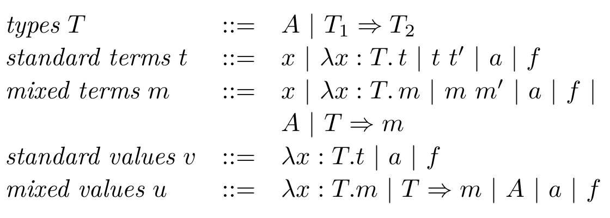
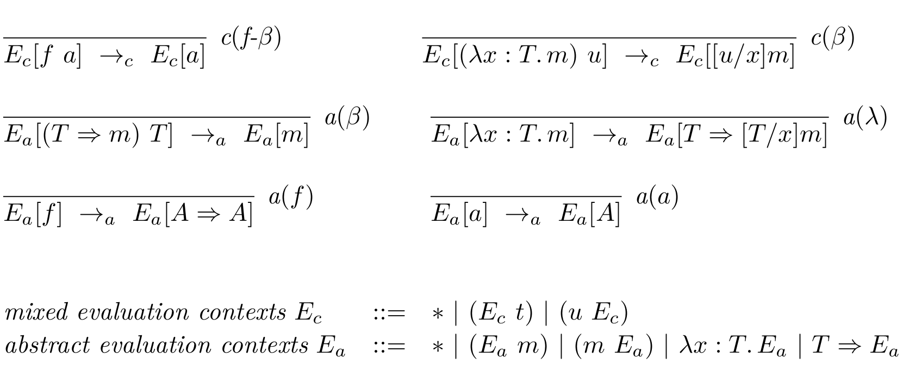
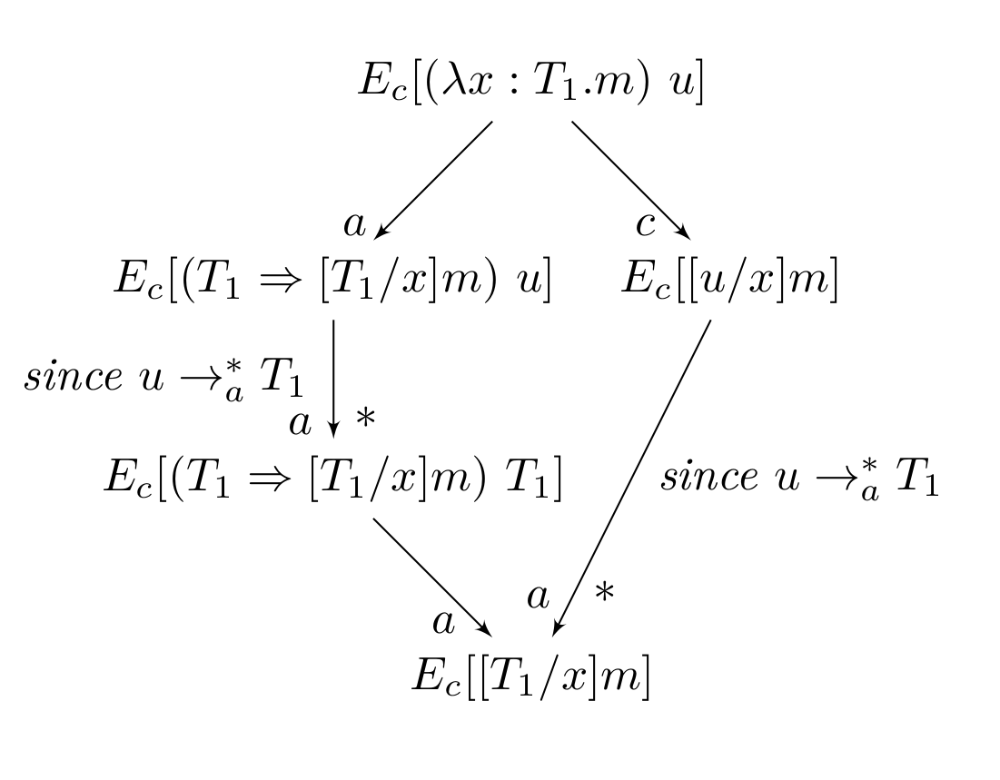

Outline
=======

-   "Type Preservation as a Confluence Problem"
    by Aaron Stump, Garrin Kimmell, and Roba El Haj Omar

-   "Confluence by decreasing diagrams"
    by Vincent van Oostrom

Definitions
===========

(Global) Confluence
-------------------

$$
\begin{tikzcd}[ampersand replacement=\&]
 t \arrow[d, "*" ] \arrow[r, "*"]  \& \arrow[d, "*", dashed] s_1 \\
   \arrow[r, "*"', dashed]  s_2               \& t'
\end{tikzcd}
$$

Local Confluence
----------------

$$
\begin{tikzcd}[ampersand replacement=\&]
 t \arrow[d] \arrow[r]  \& \arrow[d, "*", dashed] s_1 \\
   \arrow[r, "*"', dashed] s_2  \& t'
\end{tikzcd}
$$

Confluence via decreasing diagrams
==================================

by Vincent van Oostrom

Reduces proving confluence to finding a labeling on the transitions of a
transition system and a well-founded partial-order on those labels such that the local
confluence is "compatible" with that partial order. We will talk about this
"compatiblity" in detail later.

This method is complete for countable transition systems. However, Finding this
labeling can be "hard" since confluence is undecidable.

--------------------------------------------------------------------------------

The following are corollaries of the theorem of decreasing diagrams:

* Newman's lemma: If a RS is terminating and locally confluent, it is globally confluent
* Hindley-Rosen lemma: if $\rewrite{}{\alpha}$ and $\rewrite{}{\beta}$ are confluent
  and $\rewrite{*}{\alpha}$ and $\rewrite{*}{\beta}$ commute, then their union is confluent
* ...

--------------------------------------------------------------------------------

Theory of decreasing diagrams
-----------------------------------

* $\rewrite{ }{\alpha}$ rewrite one-step with transition of label alpha
* $\irewrite{ }{\alpha}$ inverse
* $\rewrite{=}{\alpha}$ reflexive closure: zero or one steps
* $\rewrite{*}{\alpha}$ reflexive transitive closure: zero or more steps
* $\downset x$ is set of the labels **strictly** less than $x$.

--------------------------------------------------------------------------------

Theory of decreasing diagrams
-----------------------------------

If every local peak can be completed to a locally decreasing diagram w.r.t. a
fixed well-founded partial ordering on labeled steps in the diagram, then the
reduction system is confluent.

A locally decreasing diagram has peaks and valleys of the form:

$$
\begin{tikzcd}[ampersand replacement=\&]
 {}                                                                 \& t \arrow[ld, "\rewrite{}{\beta}"'] \arrow[rd, "\rewrite{}{ \alpha}"] \& {}                                                            \\
    s_1 \arrow[d, "\rewrite{*}{\downset\beta}"' , dashed]                    \& {}                                                                   \& s_2 \arrow[d, "\rewrite{*}{\downset \alpha}" , dashed]             \\
 {} \arrow[d, "\rewrite{=}{\beta}"' , dashed]                                \& {}                                                                   \&  \arrow[d, "\rewrite{=}{\alpha}" , dashed]                             \\
 {} \arrow[rd, "\rewrite{*}{\downset \alpha\union\downset \beta}"' , dashed] \& {}                                                                   \&  \arrow[ld, "\rewrite{*}{\downset\alpha\union\downset\beta}" , dashed] \\
 {}                                                                 \& t'                                                                   \& {}                                                            \\
\end{tikzcd}
$$

--------------------------------------------------------------------------------

Newman's Lemma / Diamond Lemma
------------------------------

Every strongly normalizing/terminating abstract rewriting system $\mathcal A$ is confluent iff it is
locally confluent.

* label every transition $a \rewrite{}{} b$ with $a$

--------------------------------------------------------------------------------

Type preservation of STLC as a Confluence Problem
=================================================

-   Traditionally typing is viewed as a big-step semantics.
-   if, instead, we view typing as an small-steps operational semantics we can
    use our standard toolkit of rewriting tools.

In particular, we can phrase type-preservation as confluence on well-typed terms.

--------------------------------------------------------------------------------

Syntax of Simply Typed Lambda Calculus
--------------------------------------

--------------------------------------------------------------------------------

Abstract and Concrete operational Semantics
-------------------------------------------

--------------------------------------------------------------------------------

We want to show that on the set of *well-typed terms*, the combined reduction
system $ac$ is confluent.

We choose labels:

* $c$ for concrete reduction rules
* $a$ for abstract reduction rules
* and the partial order $a < c$

--------------------------------------------------------------------------------

Instantiating the theory of decreasing diagrams, we need to show:

For every typable term $t$:

1.  every $c$ - $c$ peak $s_1 \irewrite{}{c} t \rewrite{}{c} s_2$,\
    can be completed with a valley:
    $s_1 \rewrite{*}{a} \rewrite{=}{c} \rewrite{*}{a} t'
        \irewrite{*}{a}\irewrite{=}{c}\irewrite{*}{a} s_2$

2.  every $a$ - $a$ peak $s_1 \irewrite{}{a} t \rewrite{}{a} s_2$,\
    can be completed with a valley $s_1 \rewrite{=}{a} t' \irewrite{=}{a} s_2$ (i.e.
    $a$ has the diamond property)

3.  every $a$ - $c$ peak $s_1 \irewrite{}{a} t \rewrite{}{c} s_2$,\
    can be completed with a valley:
    $s_1 \rewrite{=}{c}\rewrite{*}{a} t' 
        \irewrite{*}{a}\irewrite{=}{c}\irewrite{*}{a} s_2$

--------------------------------------------------------------------------------

--------------------------------------------------------------------------------

Conclusion
----------

* Stating typing as an abstract small-step semantics gives us the power of
  term-rewriting for proving meta properties of the type system.
* The proof is simple and intuitive

<!--

1. $E_c[(\lambda x : T.m) u]$ ( reduce m / substitute )
2. $E_c[(\lambda x : T.m) u]$ ( reduce u / substitute )
3. $E_a[f a]$ (reduce f => A => A / reduce f a => a)
4. $E_a[f a]$ (reduce a => A      / reduce f a => a)

c-c peaks: Contexts don't allow any peaks to exists
a-a peaks: Three possiblilties: non-overlapping, critical overlap, non-critical overlap
    - non-overlapping: simply commute the rules that applied
    - critical overlap: no a-rules can critically overlap
    - non-critical overlap: No a-redexes duplicate/delete a-redexes:
        only duplication of subterm is of a type: where no a-rule applies to that subterm
        only deletion is of a type 
        This means we can simple complete the diamond by applying the other rule

a-c peaks:
    - parallel: a reduction on one side, c on the other: commute
    - non-critical overlap:

-->

